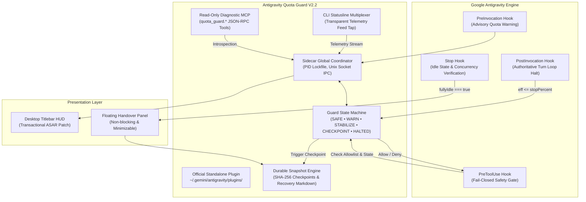

# 🛡️ Antigravity Quota Guard (V2.2 Hybrid Runtime)

> **Host-Level Hybrid Runtime Coordinator, Turn-Boundary Quota Safety & Zero-Context-Loss Handover Subsystem for Google Antigravity**  
> *هماهنگ‌کننده هیبریدی زمان اجرا، ایمنی سهمیه در مرز چرخش مدل و زیرسیستم انتقال نشست با حفظ کامل زمینه برای گوگل آنتی‌گرویتی*

[-success.svg?style=flat-square)](test/)
[](https://github.com/ar-sam/antigravity-quota-guard/releases)
[](package.json)
[](plugin.json)
[](LICENSE)

---

## 🌟 Overview / نمای کلی

**Antigravity Quota Guard V2.2** is an enterprise-grade, resilient runtime coordinator and capability extension designed specifically for [Google Antigravity](https://antigravity.google). It operates under the architectural prime directive: **"Plugin First, ASAR Last"**.

Instead of relying solely on brittle binary patches, V2.2 combines official Antigravity extension points—**Official Plugin Manifests**, **Dual-Gate Model Hooks**, an isolated **Sidecar Quota Coordinator Daemon**, a **Read-Only Diagnostic MCP Server**, and a transparent **CLI Statusline Multiplexer**—with a transactional, diff-verified ASAR presentation layer for the desktop HUD.

When your active AI quota approaches depletion (default $\le 12\%$), Quota Guard safely halts agent execution at the clean turn boundary (`PostInvocation`), creates an atomic, SHA-256 verified session checkpoint, rings a notification chime, and presents a non-blocking recovery handover panel—enabling seamless account rotation or quota renewal with **zero loss of context or conversation history**.

---

## 🏗️ Architecture / معماری هیبریدی



---

## 📊 Comparison: Legacy V1 vs. Modern V2.2

| Dimension | Legacy V1 (Single ASAR Patch) | Modern V2.2 (Hybrid Runtime Coordinator) |
| :--- | :--- | :--- |
| **Extension Model** | Monolithic ASAR modification only | **Plugin First, ASAR Last** (Plugin + Hooks + Sidecar + MCP + HUD) |
| **Model Loop Halting** | DOM UI button-click heuristics | **Authoritative Dual-Gate Hooks** (`PostInvocation` + `PreToolUse`) |
| **Fail-Open Risk** | Prone to `|| 100` fallbacks and unmonitored burns | **Fail-Closed by Design** (`0% ≠ null ≠ 100%`, cold-start blocked) |
| **Concurrency Safety** | Risk of socket split-brain on multi-window | **PID-Lockfile Leader Election** (`coordinator.pid` mode `0600`) |
| **Statusline Telemetry** | Polled or destructive overwrite | **Transparent Multiplexer** (Byte-for-byte forwarding + compact tap) |
| **MCP Integration** | None | **Real stdio JSON-RPC 2.0 MCP Diagnostic Server** |
| **ASAR Mutation** | Direct raw file overwrite (`fs.copyFileSync`) | **Transactional `AsarPatcher`** with exact bidirectional patch-diff checks |
| **Disaster Recovery** | Manual file copying | **Single-source Backup Manager** with byte-identical factory rollback |
| **Test Verification** | Basic smoke tests | **271/271 Automated Tests Passing** (E2E, Contracts, Invariants) |

---

## 🚀 Quick Start / راهنمای نصب سریع

### Prerequisites
- macOS (Apple Silicon / Intel), Linux, or Windows
- **Node.js $\ge 18.0.0$**
- Google Antigravity Desktop installed (`/Applications/Antigravity.app` on macOS)

### 1. Clone Repository
```bash
git clone https://github.com/ar-sam/antigravity-quota-guard.git
cd antigravity-quota-guard
```

### 2. Run Hybrid Installer
```bash
# Recommended: One-line install
./patch.sh install

# Or launch the interactive terminal menu
./patch.sh
```

The installer automatically executes the 7-step hybrid deployment:
1. **Preflight Checks**: Verifies running processes, disk space ($\ge 50\text{MB}$), and Electron target.
2. **Official Plugin Deployment**: Copies standalone plugin package to `~/.gemini/antigravity/plugins/antigravity-quota-guard/`.
3. **Execution Permissions**: Sets `chmod +x` on all shell hook bridges (`hooks/*.sh`).
4. **MCP Registration**: Adds `quota_guard` diagnostic server to `~/.gemini/antigravity/mcp_config.json`.
5. **Statusline Multiplexer**: Taps the CLI quota telemetry stream non-destructively.
6. **Transactional ASAR Patch**: Injects the Titlebar HUD using exact bidirectional patch-diff evaluation.
7. **Global CLI Shortcut**: Links `quota-guard` to `~/.local/bin/quota-guard` for global terminal access.

### 3. Launch Antigravity
Launch Google Antigravity Desktop. You will immediately see the native quota badge `[ 🛡️ QS: 97.6% ]` in the window titlebar.

---

## 📖 CLI Command Reference / مرجع دستورات ترمینال

You can manage Quota Guard via `./patch.sh <command>` or the global command `quota-guard <command>`:

| Command | Description (English) | توضیحات (فارسی) |
| :--- | :--- | :--- |
| `quota-guard` / `./patch.sh` | Interactive terminal dashboard | اجرای منوی تعاملی و پیشرفتهٔ ترمینال |
| `quota-guard install` | Complete hybrid runtime provisioning | نصب کامل افزونه، قلاب‌ها، MCP و پچ تراکنشی |
| `quota-guard update` | In-place update preserving backups | به‌روزرسانی درجا با حفظ نسخه‌های پشتیبان |
| `quota-guard uninstall` | Pristine factory rollback and deprovisioning | بازگشت کامل به تنظیمات اولیه کارخانه |
| `quota-guard doctor` | Comprehensive read-only subsystem audit | ممیزی کامل سلامت زیرسیستم‌ها و مجوزها |
| `quota-guard status` | Live dual-bucket quota telemetry | گزارش بلادرنگ سهمیه و وضعیت فرآیندها |
| `quota-guard config` | Interactive terminal configuration editor | ویرایشگر بصری تنظیمات و آستانه‌ها در خط فرمان |
| `quota-guard resume` | Checkpoints manager & clipboard recovery | مدیریت چک‌پوینت‌ها و بازیابی نشست در کلیپ‌بورد |
| `quota-guard coordinator` | Run Global Coordinator daemon in foreground | اجرای مستقیم دیمون هماهنگ‌کننده در پیش‌زمینه |

---

## 🩺 System Health Diagnostics (`doctor`)

To audit all subsystems, permissions, and extension points at any time:

```bash
quota-guard doctor
```

Output:
```text
============================================================
🛡️  Antigravity Quota Guard Doctor — Diagnostic Report (2.2.0)
============================================================
Timestamp: 2026-10-03T05:45:00.000Z
Overall Health Status: ✅ HEALTHY

Subsystem Status:
  • Antigravity Target:  ✅ Found (/Applications/Antigravity.app)
  • Plugin Conformance:  ✅ Conforming
  • User Configuration:  ✅ Initialized
  • Secure Storage:      ✅ 0600 Secured
  • Checkpoints Vault:   ✅ Active (3 saved)
  • Active Timezone:     🌐 Asia/Tehran (en-US)
============================================================
```

---

## 🔒 11 Canonical Security Invariants / اصول تغییرناپذیر امنیتی

Quota Guard operates under strict security redlines defined in `core/security-invariants.js`:

1. **`0 / null / 100` Distinct Typing**: $0\%$ quota is strictly preserved as $0$; missing quota is `null` (`UNKNOWN`), never co-opted to $100\%$.
2. **Atomic Disk Serialization**: Checkpoints and sensitive configs write with `0700` directory and `0600` file permissions.
3. **Renderer Authority Restriction**: The renderer process has zero direct filesystem or process-spawning authority.
4. **Monotonic Threshold Invariant**: `warnPercent > stabilizePercent > checkpointPercent > stopPercent` and `minResumePercent > stopPercent`.
5. **No Secret Exfiltration**: Never extract, steal, or transmit credentials or tokens.
6. **No Secret Logging**: Never log passwords, OAuth tokens, session cookies, or raw secrets.
7. **No Secret Display**: Never display raw authentication tokens in UI, HUD, or recovery documents.
8. **No Token Replay**: Never replay or duplicate session tokens across machines.
9. **No Cross-User Keyring Access**: Never access other OS users' keyrings or credentials.
10. **Display Timezone Isolation**: User display timezone has zero authority over core calculations, logic, or state machine transitions.
11. **Keychain Mutation Consent**: Never manipulate OS keychains or secure storage without explicit user authorization.

---

## 🧪 Testing & Verification

The project includes an exhaustive testing suite covering unit tests, contract conformance, security invariants, and real-world failure simulation:

```bash
# Run the complete test suite (271 tests across 20 suites)
npm test

# Verify documentation parity with source code
npm run docs:check

# Regenerate reference documentation
npm run docs:generate
```

All 271 tests pass with 100% green coverage across macOS and Linux runners.

---

## 🤝 Contributing & License

Contributions are welcome! Please ensure all pull requests pass `npm test` and `npm run docs:check` before submitting.

Distributed under the **MIT License**. See [LICENSE](LICENSE) for details.

---

## ⚠️ Disclaimer & Risk Notice / سلب مسئولیت و هشدار ریسک

> [!CAUTION]
> **USE AT YOUR OWN RISK**: Antigravity Quota Guard is an independent, unofficial, community-developed experimental tool and is **NOT** affiliated with, endorsed, sponsored, or maintained by Google or the Google Antigravity team.
> 
> 1. **"AS IS" & "AS AVAILABLE"**: This software, including its hooks, background daemons, CLI utilities, and Electron binary/ASAR patchers, is provided strictly on an "AS IS" and "AS AVAILABLE" basis without warranties of any kind, whether express, implied, statutory, or otherwise (including but not limited to warranties of merchantability, fitness for a particular purpose, non-infringement, stability, or uninterrupted operation).
> 2. **Modification of Application Files**: Applying this patch involves inspecting and modifying client-side binary packages (`app.asar`) and registering background sidecars and hooks. While transactional backup and rollback mechanisms are provided, modifications may cause unexpected behavior, application crashes, compatibility breaks with future Antigravity updates, or operating system security prompts.
> 3. **AI Quota & Account Management**: Quota Guard observes and estimates quota metrics to help manage model loops. However, it does not guarantee zero quota consumption or exact parity with upstream rate limits. The user is solely responsible for monitoring their account usage, API terms of service compliance, and credentials.
> 4. **Limitation of Liability**: Under no circumstances shall the authors, contributors, or copyright holders be held liable for any direct, indirect, incidental, special, exemplary, punitive, or consequential damages (including, but not limited to, loss of data, loss of profits, system downtime, business interruption, or account suspension/penalties) arising in any way out of the installation, execution, or inability to use this software, even if advised of the possibility of such damage.
>
> By downloading, cloning, installing, patching, or running any component of this project, you explicitly acknowledge, understand, and agree that **the entire risk, responsibility, and all consequences of its use rest solely and completely with you**.

> [!CAUTION]
> **مسئولیت کامل استفاده بر عهدهٔ کاربر است**: پروژهٔ Antigravity Quota Guard یک ابزار مستقل، غیررسمی و توسعه‌یافته توسط جامعهٔ کاربری است و **هیچ‌گونه وابستگی، تأییدیه، پشتیبانی یا ارتباطی با شرکت گوگل (Google) یا تیم رسمی Google Antigravity ندارد**.
> 
> ۱. **ارائه به صورت «همان‌گونه که هست» (AS IS)**: این نرم‌افزار، شامل تمامی هوک‌ها، دیمن‌های پس‌زمینه، ابزارهای خط فرمان و پچرهای فایل‌های اجرایی/ASAR، صرفاً بر مبنای «همان‌گونه که هست» و بدون هرگونه ضمانت صریح، ضمنی یا قانونی (از جمله ضمانت کارکرد بی‌نقص، پایداری، تناسب برای اهداف خاص یا عدم تداخل) ارائه می‌شود.
> ۲. **دستکاری فایل‌های برنامه**: استفاده از این پچ مستلزم بازگشایی و تغییر فایل‌های کلاینت نرم‌افزار (`app.asar`) و ثبت پردازه‌های پس‌زمینه است. علی‌رغم تعبیهٔ سیستم‌های خودکار پشتیبان‌گیری و بازگردانی (Rollback)، هرگونه دستکاری ممکن است منجر به رفتارهای غیرمنتظره، کرش برنامه، ناسازگاری با به‌روزرسانی‌های آتی نرم‌افزار اصلی یا هشدارهای امنیتی سیستم‌عامل شود.
> ۳. **سهمیه و حساب‌های کاربری**: این ابزار تخمینی از وضعیت سهمیه مصرفی را جهت توقف ایمن در مرزهای پرسش‌وپاسخ پایش می‌کند؛ با این حال تضمین‌کنندهٔ عدم مصرف سهمیه یا مصونیت حساب در برابر محدودیت‌های سرویس‌دهنده نیست. رعایت شرایط استفاده و قوانین حساب‌های کاربری کاملاً بر عهدهٔ شخص کاربر است.
> ۴. **سلب کامل مسئولیت از سازندگان**: نویسندگان، مشارکت‌کنندگان و دارندگان کپی‌رایت این پروژه تحت هیچ شرایطی در قبال هرگونه خسارت مستقیم، غیرمستقیم، تصادفی، تبعی، از دست رفتن داده‌ها، تعلیق حساب، توقف فعالیت کاری یا هرگونه آسیب ناشی از نصب، اجرا یا ناتوانی در استفاده از این ابزار مسئولیتی نخواهند داشت.
>
> **دانلود، کلون، نصب، پچ کردن یا اجرای این پروژه به منزلهٔ مطالعه، پذیرش کامل و آگاهانهٔ این هشدار است و تمام مسئولیت و پیامدهای حاصل از آن منحصراً و تماماً بر عهدهٔ خود کاربر خواهد بود.**

